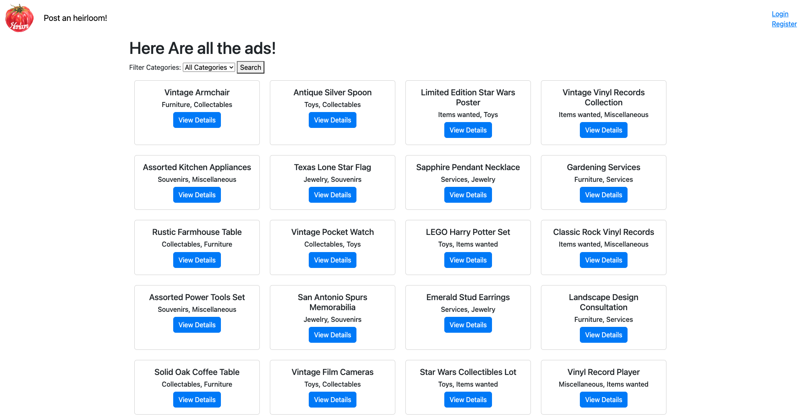
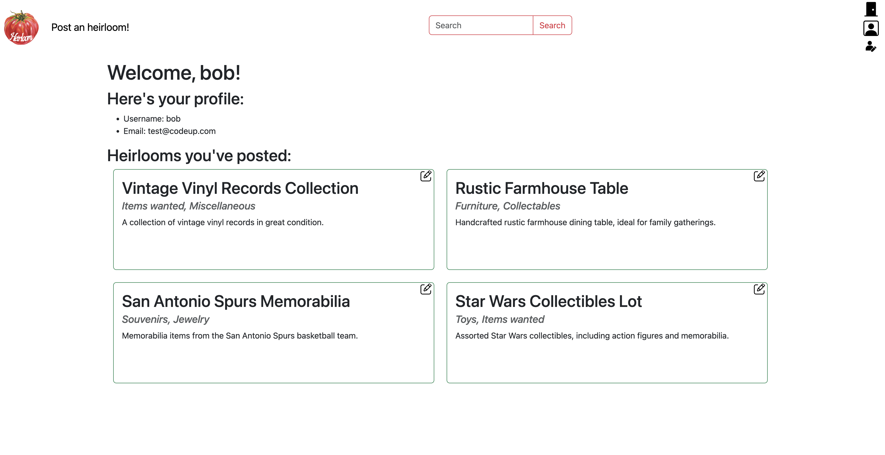
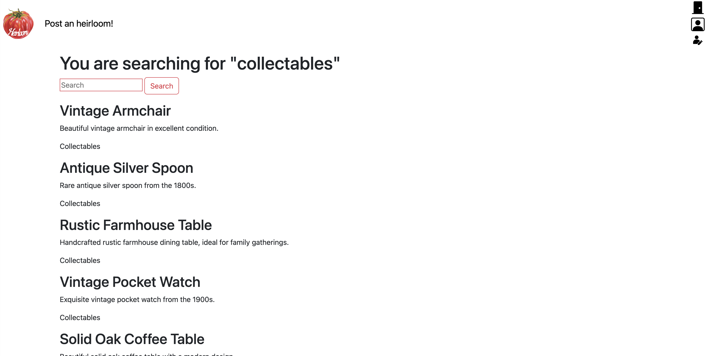
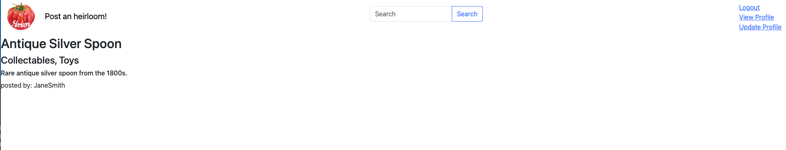

# Adlister
## Table of Contents

* [Description](#description)
* [Installation](#installation)
* [Usage](#usage)
* [Languages](#languages)
* [Tests](#tests)
* [Contributors](#contributors)
* [Credits](#credits)

 

 

 

## Description
AdLister is a Craigslist-inspired web application that allows users to post and view ads. Users can register, log in, create ads, search for ads, update their profile information, and delete their ads. The platform incorporates features such as dynamic navigation, error message display, sticky forms, and categorization of ads. It also ensures uniqueness of usernames and implements intended redirects for improved user experience.

## Installation
1. Navigate to the following link https://github.com/JZYG-AdLister-Project/adlister, and clone the project to your local machine.
2. Opened the clone project with Intellij
3. Setup the project to maven
4. Configure Tomcat with the latest version  9.0.71.
    * M1/M2 - /opt/homebrew/Cellar/tomcat@9/9.x.x/libexec
    * Intel - /usr/local/Cellar/tomcat@9/9.x.x/libexec

5. Select Artifact and choose  the java-adlister:war exploded, then click OK
6. Change the Application context field to /, then click Apply and OK.

## Usage
Start by clicking on the "Build Project" tab, and once the project is built successfully, proceed to run the Tomcat server. Keep an eye on your console as the server starts, and you will soon see the landing page appear in your browser.

## Languages
Java , HTML5, CSS, JavaScript

## Tests
NA

## Contributors
https://github.com/Joeab1991 |  https://github.com/yambaO | https://github.com/cowboyjickjack | https://github.com/zionsegovia

## Credits
Joe, Yamba , Gabriella, Zion

